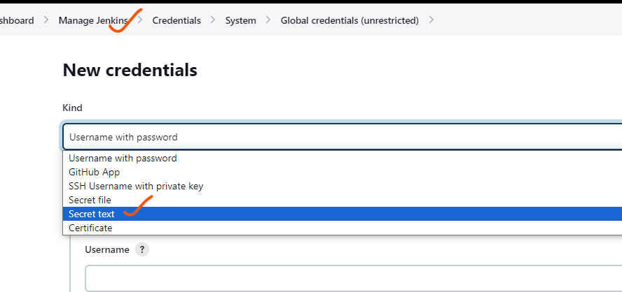
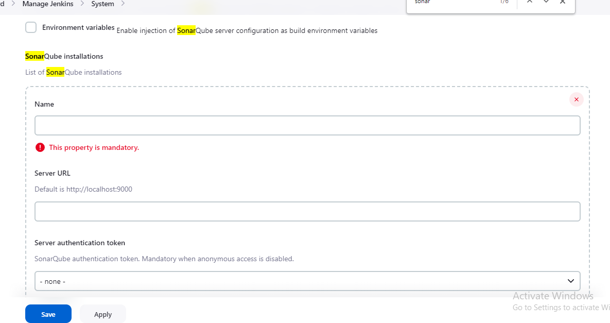

unit test: where code is return to test code (testing smaller unit of testing)

* static code analysis:  the code all will be okay or not

* quality gate:

 if will be fail the build when code quality issues exits this is called as quality gate.(code quality is failes then build will be faied)

* artifacts: it's what build/package generetes.

* repository: locaton where we store somthing. we will also have some version & history , we need to store the build artifacts of night build in artifacts repository.

* 

* check the code quality and regressions whenever developer comits the code

* manual testers will test all the work will done by developers previous day in todays works.

* Day build: developers are submitting there work(every change submitted by developers during active work hours)
    * we do minimal text  execution to
    * this should be finished quickly

* Night build:this build is done to considerate all the work done by dev team for the whole day 
    * we do execute all the automated tests
    * this might take hours and gives confidence to manual testing team so that consider this build .
    * 


### branching statagy


### SONAR-QUBE  

* sonar qube is a open-source platform developed by sonar-source for continuous inspection of code quality to perform automatic revies with static analysis of code to detect bugs and code smells on 29 programming languages .

* sonarqube offers reports on duplicated code , coding standerdes , unt tests , code coverage , code complexity , comments , bugs and security recomendations .

* sonar qube can records metrics history and provides eolution graphs
* sonar qube provides fully automated analysis and integration with maven , ant ,gradle , MS build  and continuous integration tools (bamboo , jenkins , hudson)

### pipeline - concept


#### sonarqube practice

* create sonarcloud free account
 
*  and create organizaton and project as shown below


* create token in sonarqube 


*  create 2 ec2 instances install jenkins on master and java  on  node

* create credentials with token , install pluggins and give that credentials in system management





* write pipeline for spc


```
pipeline{
    agent {label ('RRR')}
    stages{
        stage('vcs'){
            steps{
                git url: 'https://github.com/spring-projects/spring-petclinic.git',
                    branch: 'main'
            }
        }
        stage('sonar'){
            steps{
                withSonarQubeEnv('sonar-qube') {
                sh 'mvn clean package sonar:sonar -Dsonar.projectKey=hemachaitanya -Dsonar.token=bf88c07d21dfcb0edb3d119b153c5eebb9abd5ef -Dsonar.organization=hemachaitanya'
              }
            }
        }
    }
}
```


### nexus

* nexus repository operation support system(OSS) is an open source repository  , that supports many artifact formates including docker , java and npm with nexus tool integration , pipelines in your tool chnage can publish and retrieve versioned apps   and their dependencies by using central repos  that are accessible from other environments .

##### install nexus 


### two stages with same - name

* Duplicate stage name: "Build" @ line 8, column 13.
               parallel {
  this type of error will be occures
### incase build will be failed then also next stage will be run

```
pipeline {
    agent any
    stages {
        stage('Build') {
            steps {
                script {
                    try {
                        // Your build steps here
                        echo 'Building (Stage 1)...'
                        sh 'exit 1' // Simulate a build failure
                    } catch (Exception e) {
                        echo "Build failed: ${e.getMessage()}"
                        // Handle the failure, or just continue
                    }
                }
            }
        }
        stage('Build') {
            steps {
                script {
                    try {
                        // Your build steps here
                        echo 'Building (Stage 2)...'
                    } catch (Exception e) {
                        echo "Build failed: ${e.getMessage()}"
                        // Handle the failure, or just continue
                    }
                }
            }
        }
        stage('Next Stage') {
            steps {
                echo 'Running next stage...'
            }
        }
    }
}
```
* we used try cache method

## incase we want to run stage with our permissions 

```
pipeline {
    agent any
    parameters {
        choice(
            choices: ['yes', 'no'],
            description: 'Do you want to run the stage with elevated permissions?',
            name: 'runWithPermissions'
        )
    }
    stages {
        stage('User Input') {
            steps {
                script {
                    userInput = input message: 'Proceed to run stage with elevated permissions?', parameters: [choice(name: 'runWithPermissions', choices: ['yes', 'no'])]
                }
            }
        }
        stage('Run with Permissions') {
            when {
                expression { return userInput == 'yes' }
            }
            steps {
                script {
                    // Use sudo to run commands with escalated permissions
                    sh 'sudo command_with_elevated_permissions'
                }
            }
        }
    }
}

```
* using input parameters


